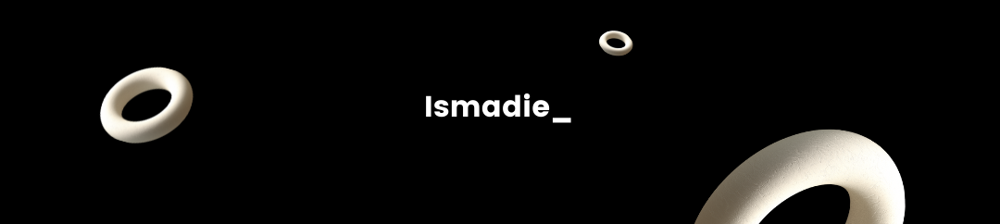

# 👋 Howdy! I'm Ismadie

I'm a tech enthusiast and builder who loves turning ideas into real, usable products — especially on the web.  

- 🧠 **What I build:** Web apps, mobile tools, and AI-powered projects  
- 🎨 **What I care about:** Clean UI, performance, and practical real-world solutions  
- 🧩 **Tech I'm using:** JavaScript, React, Node.js, Python, Tailwind CSS  
- 🚀 **Fun fact:** I love experimenting with AI and turning ideas into real products  

### 🛠️ My Toolkit

---

## 🚀 What I’m up to
- 👯 Open to collaborating on **React-based projects**  
- 🧠 Exploring **AI-powered web apps** & product-driven development  
- 🛠️ Building personal products with a focus on clean UI & real-world use cases  

---

## 🧩 Current Projects
### 🚀[Lakuin](https://lakuin.my.id)  
A personal product and experimentation platform where I design, build, and validate digital products — from idea to execution.  
Focused on usability, speed, and practical solutions for creators and everyday users.  
### ✍️ [Copyku](https://clawhub.ai/khamalismadie/copyku)
AI Copywriting Expert berbahasa Indonesia - menghasilkan copy persuasif, strategis, dan conversion-oriented untuk digital marketing, social media, landing page.

---

## 💬 Let’s talk about
- React & modern frontend ecosystem  
- Product ideas & MVP development  
- AI + Web integration  
- Open-source collaboration  

---

## 🤝 Collaboration mindset
I enjoy working with people who:  
- Ship fast but think long-term  
- Care about UX, not just code  
- Like experimenting and learning together  

📫 Feel free to reach out — discussions, collabs, or just tech talks are always welcome.  

---

### Scrimba Courses I've Completed

  
  
  

---

### 📊 GitHub Stats

  
  
