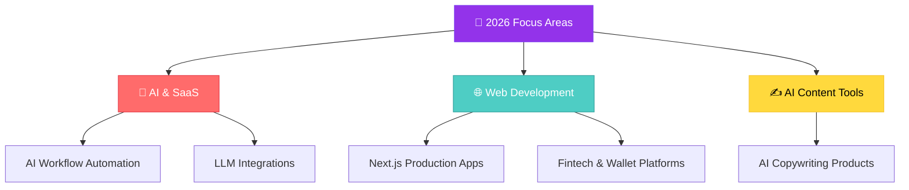

<div align="center">

# 👋 Hi, I'm Ismadie

### Full-Stack JavaScript Developer | Next.js · React · Node.js · AI Applications

I build modern web applications, SaaS products, and AI-powered solutions for startups and businesses — focused on clean code, scalability, and real business impact.

[](https://lakuin.my.id)
[](https://upwork.com/freelancers/ismadie)
[](https://github.com/khamalismadie)

</div>

---

## 🧑‍💻 About Me

```
const ismadie: Developer = {
  name: "Ismadie",
  role: "Full-Stack JavaScript Developer",
  location: "🌍 Indonesia • Open to Remote Opportunities",

  currentFocus: [
    "🤖 Building AI-powered SaaS applications",
    "⚡ Shipping fast, production-ready Next.js apps",
    "☁️ Architecting scalable full-stack systems",
    "✍️ Building AI content & copywriting tools for the Indonesian market"
  ],

  languages: {
    expert: ["JavaScript", "TypeScript"],
    proficient: ["Node.js", "SQL"]
  },

  expertise: {
    frontend: ["React", "Next.js", "Tailwind CSS"],
    backend: ["Express.js", "REST APIs"],
    database: {
      sql: ["PostgreSQL"],
      noSql: ["MongoDB"]
    },
    aiMl: ["OpenAI API", "Prompt Engineering", "AI Workflow Automation"],
    devOps: ["Docker", "Vercel", "Git"]
  },

  openTo: ["Full-Time Roles", "Freelance Projects", "Long-Term Collaborations"]
};

// My approach to development
const codePhilosophy = () => {
  return {
    design: "Simple, scalable, and maintainable",
    code: "Clean, tested, and documented",
    deploy: "Fast, secure, and business-focused",
    mindset: "Always learning, always shipping"
  };
};
```

I'm a full-stack developer with years of hands-on experience shipping production software — from fintech platforms to AI-powered products. Currently **open to full-time, contract, and freelance opportunities**.

- 🌍 Based in Indonesia · Open to Remote
- 💼 Available for full-time roles & freelance projects
- 📚 Currently pursuing a BSc in IT (International Open University)

---

## 🚀 Featured Projects

<table>
<tr>
<td width="33%" valign="top">

### 💰 [Lumina Wallet](https://luminawallet.org)

Production-ready cryptocurrency wallet platform focused on usability, security, and modern user experience.

**Stack:**
<br>


</td>
<td width="33%" valign="top">

### 🧪 [Lakuin](https://lakuin.my.id)

Product experimentation platform turning ideas into practical digital solutions. Also serves as my live portfolio.

**Stack:**
<br>


</td>
<td width="33%" valign="top">

### ✍️ [Copyku AI](https://clawhub.ai/khamalismadie/copyku)

Indonesian AI copywriting assistant that generates persuasive, conversion-focused marketing content.

**Stack:**
<br>


</td>
</tr>
</table>

---

## 💡 Development Roadmap


```mermaid
graph TB
    A[🎯 2026 Focus Areas] --> B[🤖 AI & SaaS]
    A --> C[🌐 Web Development]
    A --> D[✍️ AI Content Tools]

    B --> B1[AI Workflow Automation]
    B --> B2[LLM Integrations]

    C --> C1[Next.js Production Apps]
    C --> C2[Fintech & Wallet Platforms]

    D --> D1[AI Copywriting Products]

    style A fill:#9333EA,stroke:#7C3AED,color:#fff
    style B fill:#FF6B6B,stroke:#E63946,color:#fff
    style C fill:#4ECDC4,stroke:#35A29F,color:#fff
    style D fill:#FFD93D,stroke:#F4C430,color:#000
```

---
<div align="center">
## 🛠 Tech Stack

**Frontend**


**Backend**


**AI & Automation**


**Tools**


</div>
---

## 💼 What I Can Build

<table>
<tr>
<td width="33%" valign="top">

**SaaS Applications**
- Authentication systems
- Subscription & billing
- Admin dashboards
- Multi-tenant platforms

</td>
<td width="33%" valign="top">

**Web Applications**
- React & Next.js apps
- API integrations
- Internal business tools
- Performance optimization

</td>
<td width="33%" valign="top">

**AI-Powered Solutions**
- OpenAI/LLM integrations
- AI assistants & chatbots
- Content generation tools
- Workflow automation

</td>
</tr>
</table>

---

## 📊 GitHub Activity

<div align="center">


</div>

---

## 🤝 Open For

`Full-Time Roles` · `SaaS Development` · `Startup MVPs` · `AI Integrations` · `React / Next.js Projects` · `Long-Term Collaborations`

---

## 💼 Professional Status

[](https://upwork.com/freelancers/ismadie)
[]()
[]()

---

## 📫 Let's Connect

<div align="center">

[](https://lakuin.my.id)
[](https://upwork.com/freelancers/ismadie)
[](https://github.com/khamalismadie)

**Let's build something useful.**

</div>

---

<div align="center">

[](https://github.com/khamalismadie)

</div>
